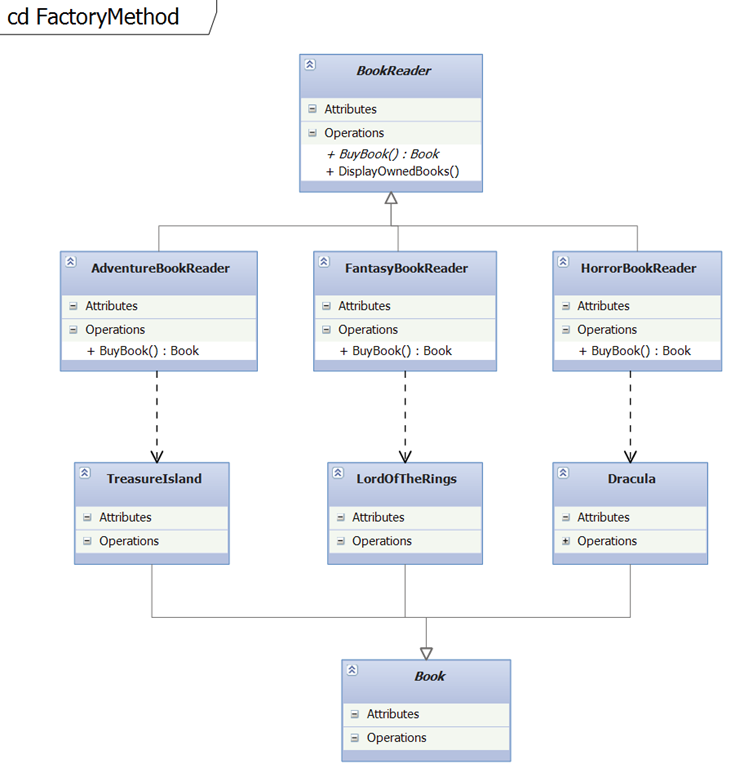
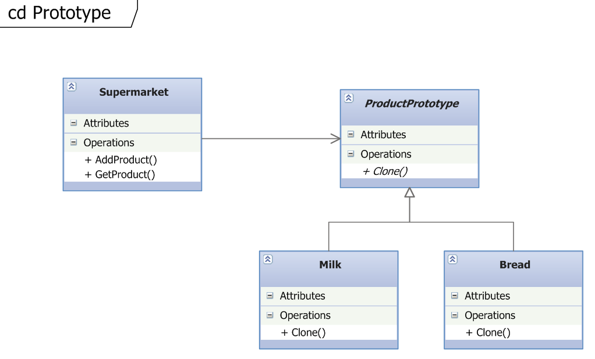
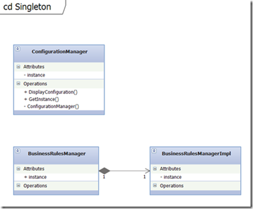

# CreationalDesignedPatterns
**Factory Method**

**Кратко описание: **

Създава инстанции от derived класове

Централизира управлението при създаването на обекти, като по този начин се предотвратява повтаряне на код при създаване на обекти.



Абстрактния „създател“ имплементира ФАКтори метод, който връща обекти. Съдържа и метод , който има за цел чрез тестове да валидира дизайна.

Всеки създател оувъррайдва абстрактния фактори метод и връща обект в зависимост от контекста.
```c#
public abstract class BookReader

{

public BookReader()

{

Book = BuyBook();

}

public Book Book { get; set; }

public abstract Book BuyBook();

public void DisplayOwnedBooks()

{

System.Console.WriteLine(Book.GetType().ToString());

}

};

public class HorrorBookReader : BookReader

{

public override Book BuyBook()

{

throw new System.NotImplementedException();

return new MurderFactory();

}

}

public class FantasyBookReader : BookReader

{

public override Book BuyBook()

{

throw new System.NotImplementedException();

return new IKnowHowToDoDesignPatterns();

}

}
```
**Prototype Pattern**

**Кратко описание:**

Използва се при копиране или клониране на инизиализирани инстанции

Предлага алтернатива на други creational patterns, които се основават на външни класове, за да създадат нещо



Определя интерфейса съдържащ метода за клониране, за да клонира себе си.

Наследяващите класове имплементират функцията за клониране. C\# дава два различни начина за клониране плитко shallow copy (само обекти най-горно ниво) или дълбоко deep copy (всички обекти).
Клиентският клас не създава сам по себе си обекти. Иска от обектите да се клонират, когато е необходимо. Клонираните обекти са перфектни копия на оригналните.
Може да се използва и IClonable интерфейс.
```C#
public abstract class ProductPrototype

{

public decimal Price { get; set; }

public ProductPrototype(decimal price)

{

Price = price;

}

public abstract ProductPrototype Clone();

}

public class Milk : ProductPrototype

{

public Milk(decimal price)

: base(price)

{

}

public override ProductPrototype Clone()

{

// Shallow Copy: only top-level objects are duplicated

return (ProductPrototype)this.MemberwiseClone();

// Deep Copy: all objects are duplicated

//return (ProductPrototype)this.Clone();

}

}

public class Bread : ProductPrototype

{

public Bread(decimal price)

: base(price)

{

}

public override ProductPrototype Clone()

{

// Shallow Copy: only top-level objects are duplicated

return (ProductPrototype)this.MemberwiseClone();

// Deep Copy: all objects are duplicated

//return (ProductPrototype)this.Clone();

}

}
```
**Singleton Pattern**

**Кратко описание**

Клас с една единствена инстанция. Използва се за да се осигури глобален достъп на обекти с една инстанция в приложението.

В примера дефолтния конструктор е дефиниран като private и по този начин обекта не може да се инстанцира отвън. Също така класа е запечатан и не се позволява наследяване.

Вътрешно инстанцирания обект се съхранява в private променлива. GetInstance се използва за да позволи достъп до този обект. Там се намира и логиката осигуряваща съществуването само на една инстанция.

За да се постигне това поведение се използва заключваща стратегия като се прави null check и се създава нова инстанция ако няма вече съществуваща.

```c#
public sealed class ConfigurationManager
    {
        private static ConfigurationManager instance;
        private static object syncRoot = new Object();
        private ConfigurationManager()
        {
       
        }
        public static ConfigurationManager GetInstance
        {
            get
            {
                lock (syncRoot)
                {
                    if (instance == null)
                    {
                        instance = new ConfigurationManager();
                    }
                }
                return instance;
            }
        }
        public void DisplayConfiguration()
        {
            Console.WriteLine("Single instance object");
        }
    }
```c#
